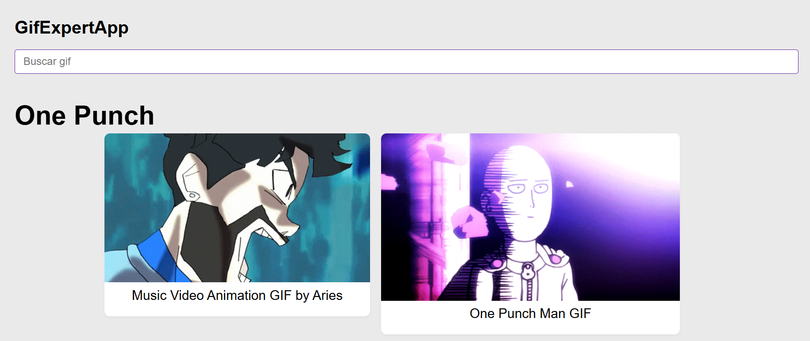

# 🎯 GifExpertApp



Ver despliegues:

- https://gifcardexpert.netlify.app/
- https://lenninibarrragonzalez.github.io/-git-expert-app/

**GifExpertApp** es una aplicación construida con React que permite buscar y visualizar GIFs animados utilizando la API de Giphy. Ideal para practicar conceptos de React como componentes, hooks personalizados y manejo de estado.

---

## 🚀 Características

- 🔍 Búsqueda de GIFs por categorías.
- 🖼️ Resultados mostrados en formato de tarjetas.
- 🧭 Interfaz limpia, intuitiva y responsiva.

---

## 🛠️ Tecnologías utilizadas

- **React** – Biblioteca para construir interfaces de usuario dinámicas.
- **Vite** – Herramienta de desarrollo rápida y moderna.
- **CSS** – Estilos personalizados y diseño visual.

---

## 📦 Instalación

1. Clona este repositorio:
   ```bash
   git clone https://github.com/tu-usuario/gif-expert-app.git
   ```
2. Accede al directorio del proyecto:
   cd gif-expert-app

3. Instala las dependencias:
   yarn

▶️ Uso
Inicia el servidor de desarrollo:
yarn dev

📁 Estructura del proyecto

```text
src/
├── components/       # Componentes reutilizables
├── helpers/          # Funciones auxiliares (fetch a Giphy, etc.)
├── hooks/            # Hooks personalizados
├── styles.css        # Estilos globales
├── main.jsx          # Punto de entrada de la aplicación
└── GifExpertApp.jsx  # Componente principal
```

🛠️ Personalización
Para modificar los parámetros de búsqueda (como el límite de resultados o la clave de API), edita el archivo:
src/helpers/getGifs.js

📄 Licencia
Este proyecto está bajo la licencia MIT.
¡Siéntete libre de usarlo, modificarlo y compartirlo!

```

```
